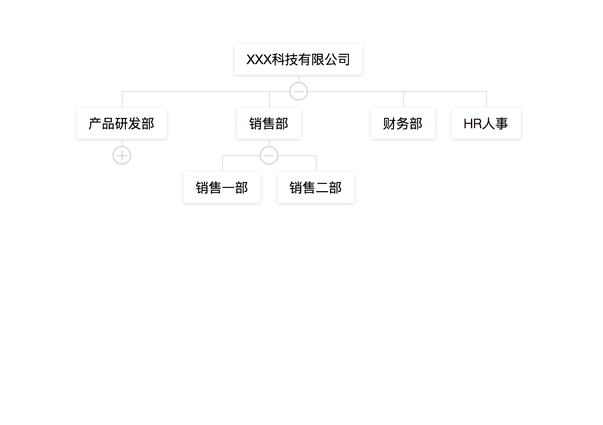
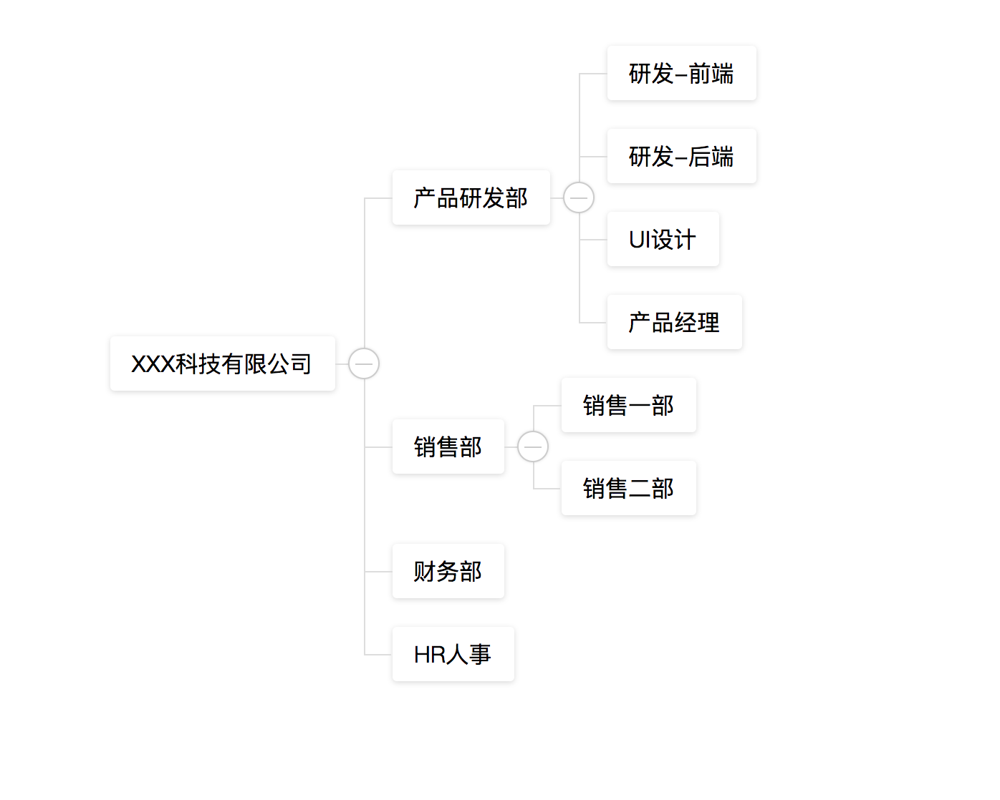

# vue-org-tree

> A simple organization tree chart based on Vue2.x

## Usage

### NPM

```
# use npm
npm i vue2-org-tree

# use yarn
yarn add vue2-org-tree
```
### Import Plugins

``` js
import Vue from 'vue'
import Vue2OrgTree from 'vue2-org-tree'

Vue.use(Vue2OrgTree)

// ...
```

### CDN

``` html
# css
<link href="https://unpkg.com/vue2-org-tree@1.1.0/dist/style.css">

<!--
...
-->

# js
<script src="https://unpkg.com/vue@2.5.17/dist/vue.js"></script>
<script src="https://unpkg.com/vue2-org-tree@1.1.0/dist/index.js"></script>
```


## API

  * #### props


	prop           | descripton                   | type                   | default
	---------------|------------------------------|:----------------------:|---------------------
	data           |                              | `Object`               |
	props          |  configure props             | `Object`               | `{label: 'label', children: 'children', expand: 'expand'}`
	labelWidth     |  node label width            | `String` \| `Number`.  | `auto`
	collapsable    | children node is collapsable | `Boolean`              | `true`
	renderContent  | how to render node label     | `Function`             |     -
	labelClassName | node label class             | `Function` \| `String` |     -


  * ### events

    - on-expand

      well be called when the collapse-btn clicked


    - on-node-click

      well be called when the node-label clicked


## Example

- default

  

- horizontal

  

## Browser support

    use table layout!

> IE9+、Chrome、Firefox、Opera

## Change log

  - 1.1.0

    * Extract CSS
    * Fixed unable to use in browser [#9](https://github.com/hukaibaihu/vue-org-tree/issues/9)

## License
[MIT](http://opensource.org/licenses/MIT)
